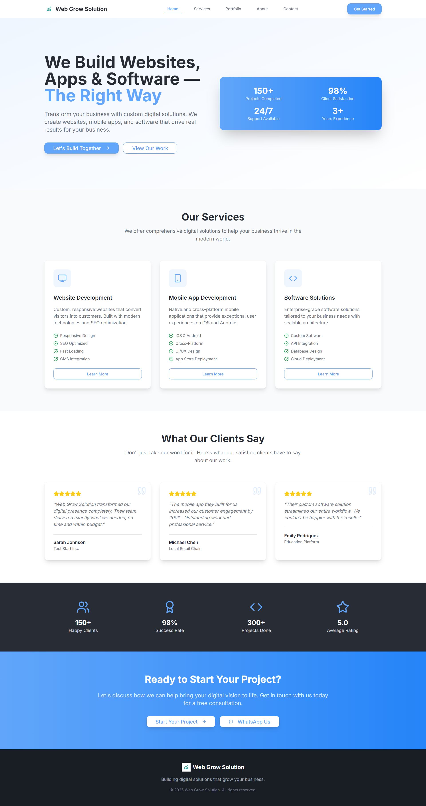

# Web Grow Solutions

A professional website showcasing digital solutions including custom website development, mobile app development, and software solutions tailored to grow your business.

## Screenshots

  
  

## Features

- Responsive and SEO-optimized design
- Custom website, mobile app, and software development services
- Modern UI/UX design and digital growth solutions
- Client testimonials and industry-specific solutions

## Technologies Used

- Frontend:
  - React
  - Vite
  - Tailwind CSS
  - Lucide React Icons
- Backend:
  - Express.js
  - Node.js

## Architecture

- Frontend built with React functional components and Vite as the build tool
- Pages structured under `client/pages` with direct footer implementation
- UI components organized under `client/components/ui`
- Backend server implemented with Express.js located in the `server` directory
- Separate build process for client and server using Vite
- Styling handled with Tailwind CSS utility classes
- Routing on frontend handled by React Router DOM
- Assets stored under `client/assets`

## Getting Started

1. Clone the repository:
   ```bash
   git clone <repository-url>
   ```
2. Install dependencies:
   ```bash
   npm install
   ```
3. Run the development server:
   ```bash
   npm run dev
   ```
4. Open your browser and navigate to:
   ```
   http://localhost:3000
   ```

## Contact

For inquiries or support, please contact Web Grow Solutions at [email@example.com].

## License

This project is licensed under the MIT License.
